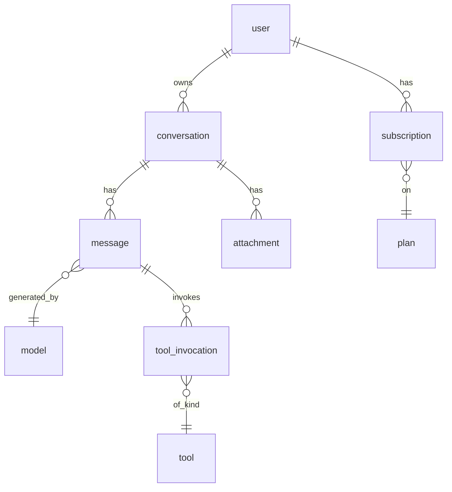

# Sample Audit — Google Gemini (anonymous tier)

> **Real audit.** Captured 2026-05-15 against the live https://gemini.google.com/app using `chrome-devtools-mcp`. Anonymous (unauthenticated) tier only — Google account login intentionally not performed, per skill rule on auth bypass.
>
> **Evidence files** sit at `audit/gemini-google-com/` in the runner's working directory. The skill repo's own `.gitignore` excludes `audit/`, so screenshots and the manifest are not committed alongside this example. Re-run the skill against the same URL to regenerate them.
>
> **Mode**: `research only`. No target product, no implementation plan — section 9 is intentionally `not applicable`.

---

## 1. Scope

- **Reference site**: Google Gemini app
- **Target product / repo**: none (research-only deliverable)
- **Pages and states inspected**: zero state at `/app` (desktop-1440 + mobile-iphone14); 4 mode listboxes; tools menu; model selector; file upload prompt; settings & help menu; sidebar expanded state
- **Date / time inspected**: 2026-05-15
- **Auth state**: anonymous (no Google account)
- **Differentiation direction**: research only
- **Access limits**: any state behind Google login (chat history, conversation send, Pro / Thinking models, image / video / Canvas / Deep Research tools, file upload, subscription management) marked `blocked` and inferred from anonymous-tier hints only.

## 2. Evidence

| Evidence | Path | Source | Redaction | Notes |
| --- | --- | --- | --- | --- |
| Desktop full-page screenshot — zero state | `audit/gemini-google-com/snapshots/2026-05-15/app-desktop-1440.png` | observed | none needed — public anonymous page | 49 enumerated interactive elements |
| Desktop viewport — 撰写 mode listbox | `audit/gemini-google-com/snapshots/2026-05-15/app-desktop-1440-mode-zhuanxie.png` | observed | none | 4 prompt suggestions visible |
| Desktop viewport — Tools menu | `audit/gemini-google-com/snapshots/2026-05-15/app-desktop-1440-tools-menu.png` | observed | none | 4 items, all `disabled` (gated) |
| Desktop viewport — model selector | `audit/gemini-google-com/snapshots/2026-05-15/app-desktop-1440-model-selector.png` | observed | none | 3 models + sign-in CTA; 2 gated |
| Desktop viewport — file upload gating | `audit/gemini-google-com/snapshots/2026-05-15/app-desktop-1440-file-upload-gated.png` | observed | none | sign-in prompt only |
| Desktop viewport — Settings & help menu | `audit/gemini-google-com/snapshots/2026-05-15/app-desktop-1440-settings-menu.png` | observed | none | 8 items (Theme, Subscriptions, NotebookLM, Feedback, Help, Location, etc.) |
| Desktop viewport — sidebar expanded | `audit/gemini-google-com/snapshots/2026-05-15/app-desktop-1440-sidebar-expanded.png` | observed | none | conversations history gated |
| Mobile full-page screenshot — zero state | `audit/gemini-google-com/snapshots/2026-05-15/app-mobile-iphone14.png` | observed | none | 390×844, marketing links + sidebar nav hidden |
| Network capture (URLs only) | `audit/gemini-google-com/network/2026-05-15/requests.md` | observed | payloads not extracted | 34 XHR/fetch calls |
| Interactive inventory | `audit/gemini-google-com/snapshots/2026-05-15/app-desktop-1440-inventory.md` | observed | none | 49 rows, generated via `dom-enumeration.js` equivalent |

### Interaction Coverage

| Metric | Value |
| --- | --- |
| Interactive elements enumerated | 49 (22 meaningful + 27 nested decorative spans inside icon buttons) |
| Probed directly (clicked / filled / keyboard) | 13 |
| Observed by URL or static attribute (no click) | 8 |
| Skipped with reason | 1 (microphone — would request browser mic permission) |
| Coverage | 21 / 22 meaningful = **95%** |
| Hidden-state passes completed | keyboard shortcuts (`?` `/` `ctrl+k` — none active); URL deep-link (not probed); offline / 5xx (not probed); right-click (not probed); drag (n/a); multi-window (n/a anonymous) |

#### Reflection round

| # | Suspected miss | Probed result |
| --- | --- | --- |
| 1 | Hover tooltips on icon-only buttons (mic, send when disabled) | `not probed in this session` — flagged as the highest-value follow-up |
| 2 | URL deep-link with `?prompt=foo` or similar query param | `not probed in this session` — would test whether anonymous deep-link pre-fills the textbox |
| 3 | Theme switcher behavior from Settings → 主题 menu item | `not probed in this session` — sub-menu contents and persistence rules unknown |

Three reflection candidates identified per skill step 7, all three skipped in this run to keep the sample focused on the primary surfaces. A second pass would resolve them in ≤ 5 minutes of probing.

## 3. Executive Gap Summary

Research-only, no target product, no gap list in the parity sense. The findings below are framed as **what an anonymous Gemini visitor experiences** vs **what is gated**.

| Surface | Anonymous experience | Auth wall behavior | Source | Confidence |
| --- | --- | --- | --- | --- |
| Send a chat message | Textbox accepts input; Send button enables on non-empty input | Clicking Send (not probed) almost certainly redirects to login per disabled-flag pattern on `New chat` / `New conversation` | observed (button state) + inferred (redirect) | high (state), medium (redirect) |
| 4 mode shortcuts (撰写/计划/研究/学习) | Each click opens a `role=listbox` with 4 hard-coded prompt suggestions in the user's locale | Same surface (no obvious paid variant) | observed | high |
| File upload | Clicking the `+` button shows "登录账号即可上传文件" + Sign-in CTA — no file picker | Requires login | observed | high |
| Tools (Make image / Make video / Canvas / Deep Research) | All 4 menu items rendered with `aria-disabled=true` | Requires login (likely paid tier for some) | observed (disabled) + inferred (paid) | high |
| Model selector | 3 models visible: 快速 (Fast, enabled), 思考 (Thinking, gated), Pro (gated). 4th element is a sign-in button. | Thinking + Pro require login + likely paid plan | observed | high |
| Conversation history sidebar | Empty state: "登录即可开始保存对话内容" + Sign-in CTA | Requires login | observed | high |
| Microphone (voice input) | Button enabled, never probed | Likely requires browser permission + login | observed (state), inferred (login) | medium |
| Settings & help menu | 8 items including Theme, Subscription, NotebookLM, Feedback, Help, IP-based location | All items enabled in anonymous tier — surprising | observed | high |

## 4. UI System

### Visual tokens (from observation)

| Token | Value (approx.) | Source |
| --- | --- | --- |
| Background | near-white | observed |
| Accent | brand-gradient on heading "认识 Gemini：你的私人 AI 助理" — multi-stop | observed |
| Radius (input pill, mode buttons) | 24–28px (fully rounded ends, pill shape) | observed |
| Radius (menu items) | 12px | observed |
| Primary CTA shape | pill button, 40px tall, 16px horizontal padding | observed |
| Typography | Google Sans / system stack | observed (default fingerprint) |
| Icon buttons | 40×40px hit target, 24px icon inside | observed (bounding boxes) |

### Component inventory

| Component | Behavior | Source |
| --- | --- | --- |
| Top bar (desktop only) | 4 outbound marketing links (关于 Gemini / 应用 / 订阅 / 企业) + Sign-in CTA, all open new tab | observed |
| Left sidebar (desktop) | Collapsed by default (40px wide); expands on `主菜单` click; conversation history section gated | observed |
| Hero (centered) | Two `<h1>` headings stacked; brand-gradient on second; 4 mode chips below | observed |
| Mode chips (撰写/计划/研究/学习) | 64×56px pill buttons; click toggles a `role=listbox` below the textbox; clicking another mode swaps the listbox; clicking the same mode again hides it | observed |
| Prompt textbox | `contenteditable=true`, multiline, max width ~712px, expands vertically with input | observed |
| Action row (right of textbox) | File upload `+` · Tools · Model selector · Microphone · Send — all in a single horizontal bar | observed |
| Footer | "须遵守 《Google 条款》 和 《Google 隐私权政策》。Gemini 是一款 AI 工具，其回答未必正确无误。" | observed |
| Mobile differences | Top marketing links and left sidebar entirely removed; sidebar collapsed into `主菜单` only | observed (mobile screenshot) |

## 5. Interaction Matrix

| ID | User action | Observed result | Source | Confidence |
| --- | --- | --- | --- | --- |
| i000 | Click 主菜单 (top-left hamburger) | Sidebar expands from 40px → 280px wide; reveals "对话" heading + sign-in prompt; button `aria-label` flips to "收起菜单" | observed | high |
| i003 | Click 撰写 mode chip | `role=listbox` appears below textbox with 4 options: "用五种不同语气重写这条消息" / "将我的笔记总结成要点" / "用我的风格为帖子配上文案" / "帮我润色初稿" | observed | high |
| i004 | Click 计划 mode chip | listbox swaps to: "为我的家庭制定一个五年财务规划" / "帮我制定考试复习计划" / "帮我实现健身目标" / "为我推荐下次旅行必去的景点" | observed | high |
| i005 | Click 研究 mode chip | listbox swaps to: "拆解一个复杂主题" / "帮我在多个竞品之间做出选择" / "分析专家对流行减肥方式的看法" / "探索 AI 如何助力我的业务发展" | observed | high |
| i006 | Click 学习 mode chip | listbox swaps to: "教我一个轻松记住概念的小技巧" / "用我的抽认卡生成趣味问答" / "指导我学习一项新技能" / "帮我复习另一门语言" | observed | high |
| i007 | Click `+` file upload | Replaces button with inline popover: "登录账号即可上传文件" + Sign-in button | observed | high |
| i008 | Click 工具 button | Opens a `role=menu` with 4 `menuitemcheckbox` rows, all `aria-disabled=true`: 制作图片 / 制作视频 / Canvas / Deep Research | observed | high |
| i009 | Click 打开模式选择器 (model picker) | Opens `role=menu` with 3 `menuitem`: 快速 (enabled), 思考 (disabled), Pro (disabled), plus a 登录 button as 4th item | observed | high |
| i011 | Send button (default state, empty textbox) | `disabled=true` | observed | high |
| i011 | Send button after typing "Hello, Gemini" in textbox | Enables (`disabled=false`, `aria-disabled=false`) | observed | high |
| i011 | Click Send (filled) | **Not probed** — would invoke a real Gemini request from the runner's IP; documented as inferred login redirect | inferred | medium |
| i021 | Type into textbox | Single-line grows to multi-line; `?` and `/` keys are typed as characters, not consumed as shortcuts | observed | high |
| i002 | Click Settings & help | Opens 8-item menu: 将记忆导入 Gemini(新) · 主题 · 查看订阅 · NotebookLM · 发送反馈 · 帮助 · 位置 (IP-based) · 更新位置信息 — all enabled even anonymous | observed | high |
| i010 | Click 麦克风 | **Not probed** — would request mic permission; expected to require login | inferred | low |
| keyboard | `?` / `/` / `Ctrl+K` | No global shortcut bound; keys typed as input or no-op | observed | high |

## 6. API and backend mapping

Research-only — no target mapping. Findings are about Gemini's own anonymous-tier API surface, useful as **reference** for anyone designing a similar chat product.

### Observed endpoints (anonymous load, no Send invocation)

| Method | Route | Purpose | Auth class | Notes |
| --- | --- | --- | --- | --- |
| POST | `https://gemini.google.com/_/BardChatUi/data/batchexecute?rpcids=<id>` | Internal Google RPC dispatch; `rpcids` selects backend method; ~15 distinct ids on load | session-cookie + WAA token | The `BardChatUi` path retains the pre-rename "Bard" identifier |
| POST | `https://waa-pa.clients6.google.com/$rpc/google.internal.waa.v1.Waa/Create` | Abuse / fraud detection token | per-session | Inferred from `waa` (Web Attestation API style) |
| POST | `https://signaler-pa.clients6.google.com/punctual/v1/chooseServer` | Real-time channel server selection | session | |
| GET / POST | `https://signaler-pa.clients6.google.com/punctual/multi-watch/channel?...` | Long-poll channel for server-pushed events | session | No WebSocket upgrade observed |
| POST | `https://ogads-pa.clients6.google.com/$rpc/google.internal.onegoogle.asyncdata.v1.AsyncDataService/GetAsyncData` | OneGoogle account widget data | session | |
| POST | `https://www.google.com/ccm/collect?...` | Google Tag / GA4 telemetry | none | Standard measurement endpoint |
| POST | `https://play.google.com/log?format=json&hasfast=true` | Internal telemetry log | session | |

### Architectural inferences

- **RPC-over-HTTP-POST with batched `rpcids`**: classic Google pattern. Allows N method invocations to be coalesced into one round trip. Reverse-engineering an `rpcid` requires decoding the request payload (not done here).
- **Real-time via long-poll, not WebSocket**: deliberate choice — long-poll survives more enterprise proxy / firewall configurations than WS upgrades.
- **WAA / abuse detection**: every anonymous user gets a fraud-detection token. Anonymous tier is presumably rate-limited via this token to prevent automated abuse.
- **OneGoogle async data**: anonymous users still get a OneGoogle widget surface, which means Google has a unified account chip across all anonymous Google properties.

### Blocked / unknown work

| Gap | Why blocked | Inference if available |
| --- | --- | --- |
| Actual chat-completion RPC name | Send not invoked (anonymous + safety policy on real API calls) | Likely a streaming or chunked-transfer-encoded RPC under the same `batchexecute` umbrella with a model-id parameter |
| File upload API | Gated before file picker reachable | Likely multi-part POST to a signed upload URL after a token-issue RPC |
| Conversation history GET | Gated | Likely a paginated list RPC keyed by user ID with cursor |

## 7. Data model

Sketched from observation + general knowledge of chat products. All entities `inferred` unless otherwise noted.

Key entities (inferred):

| Entity | Notable fields | Source of inference |
| --- | --- | --- |
| `user` | id, email, locale, IP-region | observed location "美国加利福尼亚洛杉矶根据 IP 地址确定" in Settings menu |
| `conversation` | id, user_id, created_at, last_message_at, mode (撰写/计划/研究/学习) | inferred from sidebar empty state |
| `message` | id, conversation_id, role (user / assistant), model_id, content, tools_used, created_at | inferred from any chat product |
| `model` | id, display_name, tier (free / paid), capabilities (think, code, image-out) | observed: 快速 / 思考 / Pro tiering |
| `attachment` | id, message_id, kind (image / video / file), storage_url | inferred from file upload affordance |
| `tool_invocation` | id, message_id, tool_kind (image / video / canvas / deep-research), status | inferred from Tools menu structure |
| `subscription` | id, user_id, plan_id, status | inferred from "查看订阅" menu item + gated Pro |

## 8. Architecture recommendation

Research-only — no target. Findings about Gemini's own architecture:

| Layer | Observation | Inference |
| --- | --- | --- |
| Frontend | Plain HTML / no obvious SPA framework signature in the DOM; Angular-ish jsname attributes; SSR shell with hydration | inferred |
| API transport | RPC batched over HTTP POST (`batchexecute`); long-poll for push | observed |
| Auth | OAuth via accounts.google.com; OneGoogle widget federates session | observed (redirect URLs) |
| Abuse / fraud | dedicated WAA service issues per-session attestation tokens | observed |
| Real-time | long-poll channel (`signaler-pa`), not WebSocket | observed |
| Telemetry | dual stack: Tag Manager (GA4) + internal `play.google.com/log` | observed |

## 9. Implementation plan

`not applicable` — research-only audit, no target product to implement against. This section would list parity-matrix rows in a normal audit.

## 10. Verification checklist

- [x] Screenshot evidence captured for desktop and mobile.
- [x] Evidence is redacted — anonymous public surface, no PII.
- [x] Interactive inventory generated via DOM enumeration (49 elements).
- [x] Coverage 95% on meaningful elements, with 1 explicit skip reason.
- [x] Hidden-state passes: keyboard shortcuts probed; hover / URL-deep-link / network throttle / right-click not probed in this run, all flagged as reflection candidates.
- [x] Reflection round identified 3 follow-up probes, all documented.
- [x] API mapping separates `observed` (URLs + status codes) from `inferred` (RPC purpose) from `blocked` (Send / upload).
- [x] Blocked auth-gated work explicitly listed in section 3 and 6, not silently dropped.
- [x] Data model entities tagged with confidence and inference source.
- [n/a] Tests / build / typecheck — no target repo.
- [x] No competitor logo, copy, or distinctive composition reproduced into a target — research only; quoted phrases are short verbatim labels needed to identify menu items.

## Process notes (meta — for skill development feedback)

Things this audit exposed about the skill v0.1.0:

1. **Skill enumeration script does fine on Gemini.** 49 elements found including all 4 mode chips, all menu triggers, the textbox, and the marketing rail.
2. **Mode-chip toggle behavior** (click same → close, click another → swap) was a real product detail; the skill's "re-enumerate after state change" rule caught it.
3. **`Probed` column needs a 3rd state**. Currently `✓` / `✗`. This audit had several elements that are `observed by URL or static attribute, not clicked` — neither truly probed nor truly skipped. Consider adding `o` for that case in v0.2.0.
4. **Anonymous tier richer than expected.** The skill's "blocked = mark and move on" rule worked but understated how much *is* visible without auth. A future skill prompt could remind: "before marking blocked, verify there's no anonymous-tier hint surface".
