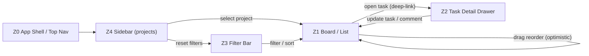
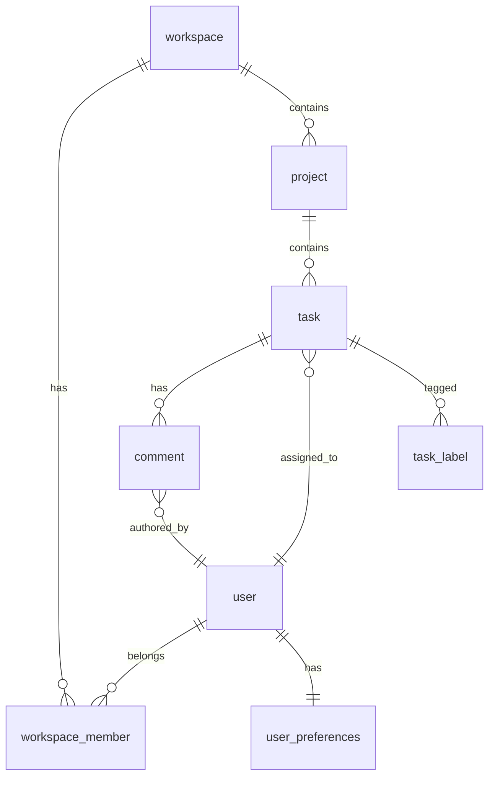
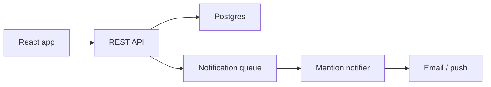

# Sample Audit — "Acme Tasks" (fictional)

> **This is a fictional walkthrough.** No real competitor was inspected, no real network traffic was captured, and all paths/payloads are illustrative. Its purpose is to show what a completed deliverable looks like end-to-end. When you run the skill for real, every claim must be traceable to actual `observed` / `documented` / `inferred` / `blocked` / `not applicable` evidence — not copied from this file.

Filled against [../references/output-template.md](../references/output-template.md). A real-world audit would attach real screenshot files; here we cite `evidence/*.png` placeholders.

---

## 1. Scope

- **Competitor**: Acme Tasks (fictional collaborative task manager)
- **Target product / repo**: `~/code/our-task-app` (hypothetical)
- **Pages and states inspected**: marketing landing, signup, dashboard, project view (kanban + list mode), task detail drawer, mobile dashboard, paid-tier upsell modal
- **Date / time inspected**: 2026-05-14 14:00–17:30 UTC+8
- **Auth state**: free-tier account (no paid features accessed)
- **Differentiation direction**: workflow parity with target design system
- **Access limits**: paid-tier "Workflow Automations" and "SSO Settings" marked blocked

## 2. Evidence

Manifest at `audit/acme-tasks/MANIFEST.md`. Today's snapshots in `audit/acme-tasks/snapshots/2026-05-14/`. Dashboard + kanban reused from the previous audit (within the 30-day window); mobile dashboard and DOM dumps re-captured because they were absent or stale. Network traces always fresh.

| Evidence | Path / URL | Source | Redaction | Notes |
| --- | --- | --- | --- | --- |
| Desktop screenshot — dashboard | `audit/acme-tasks/snapshots/2026-04-22/dashboard.png` | observed (cached from 2026-04-22) | username masked | reused via manifest |
| Desktop screenshot — project kanban | `audit/acme-tasks/snapshots/2026-04-22/kanban.png` | observed (cached from 2026-04-22) | task titles replaced with `<task N>` | reused via manifest |
| Mobile screenshot — dashboard | `audit/acme-tasks/snapshots/2026-05-14/dashboard-mobile.png` | observed | username masked | iPhone 14 viewport — fresh capture |
| DOM / text dump — task detail | `audit/acme-tasks/snapshots/2026-05-14/task-detail.html` | observed | task body + comments stripped | only structural markers kept |
| Network log — task CRUD | `audit/acme-tasks/network/2026-05-14/tasks.har` | observed | `Authorization`, `Cookie`, user IDs redacted | auth class only |
| Interactive inventory | `audit/acme-tasks/snapshots/2026-05-14/interactive-inventory.md` | observed | n/a | 87 stable IDs across 5 pages |

### Interaction Coverage

| Metric | Value |
| --- | --- |
| Interactive elements enumerated | 87 |
| Probed | 82 |
| Coverage | 82 / 87 (94%) |
| Hidden-state passes completed | hover · keyboard · right-click · drag · scroll · input-edge · network · url-history · multi-window |

5 un-probed elements: all on the paid Automations page (`acme-auto-01..05`), marked `blocked` — free-tier account cannot reach the surface.

#### Reflection round

| # | Suspected miss | Probed result |
| --- | --- | --- |
| 1 | "Saved filter" persistence after logout / re-login | `observed` — saved filters survive session via server-side `user_preferences` table |
| 2 | Bulk actions on multi-selected tasks | `observed` — `shift+click` selects range, exposes toolbar with archive / assign / label |
| 3 | Error recovery when offline submitting a comment | `observed` — queued in `localStorage`, retried on reconnect with a toast |

## 3. Executive Gap Summary

| Priority | Area | Gap | Impact | Source | Confidence | Recommendation |
| --- | --- | --- | --- | --- | --- | --- |
| P0 | Task detail (Z2) | Drawer has inline comments + @mentions; target has none | Blocks team-collaboration parity | observed | high | Build comment thread + mention index; needs `comments` table + notification job |
| P0 | Kanban view (Z1) | Drag-and-drop reorder persists optimistically; target lacks the view entirely | Primary workflow gap | observed | high | Add board view with DnD; API needs `position` field + reorder endpoint |
| P1 | Mobile (Z1) | Sticky bottom CTA for "Add task" with safe-area inset | Mobile creation flow feels broken without it | observed | high | Add sticky CTA + `env(safe-area-inset-bottom)` padding |
| P1 | Filters (Z3) | URL-encoded filter state (shareable links) | Power-user workflow | observed | medium | Move filter state to query params; add `parseFilters` reducer |
| P2 | Empty states | Animated illustrations + 3 onboarding CTAs in every empty zone | Polish, not blocking | observed | medium | Target brand illustration set; do not copy Acme's |
| P2 | Settings → Automations | Paid-only; cannot inspect | Cannot estimate scope | blocked | low | Search Acme's public docs/changelog; mark as separate epic |

## 4. UI System

### Visual Tokens

| Token | Competitor | Target Recommendation | Source |
| --- | --- | --- | --- |
| Background | near-white (#FAFAFA-ish) | keep our `--bg-canvas` | observed |
| Panel | white with 1px hairline border | keep our `--panel-1` | observed |
| Accent | warm orange | **do not copy** — use our brand teal | observed |
| Text | high-contrast near-black | our `--fg-primary` | observed |
| Radius | 8px on cards, 6px on inputs | align to our 8/6 scale (already matches) | observed |
| Spacing scale | 4 / 8 / 12 / 16 / 24 | our 4-step scale matches | observed |
| Font family | Inter-class geometric sans | our existing UI font (do not switch) | observed |

### Component Inventory

| Component | Competitor Behavior | Target Component | Status | Source | Notes |
| --- | --- | --- | --- | --- | --- |
| Top nav | Workspace switcher + global search + new-button | `<AppShell>` exists | matched | observed | |
| Sidebar | Collapsible, persists state in `localStorage` | `<SidebarNav>` exists, doesn't persist | different by design | observed | Add localStorage persistence |
| Kanban board | Multi-column DnD, virtualized | none | **missing** | observed | New component required |
| Task card | Title + assignee avatar + due chip + label dots | `<TaskRow>` (list only) | different by design | observed | Add `<TaskCard>` for board mode |
| Task detail drawer | Right-side drawer, ESC closes, URL deep-links | `<TaskDetail>` is modal | different by design | observed | Migrate to drawer or document the divergence |
| Comment thread | Inline composer + mentions + reactions | none | **missing** | observed | New subsystem |
| Filter chip bar | Chips with remove-X, URL-synced | `<FilterBar>` exists, state in component only | different by design | observed | Sync to URL |
| Upsell modal | Triggered on gated action; cannot dismiss permanently | none | blocked | observed | Out of scope until our billing ships |

### Representative Component Example

Structural pattern for the task card — using target brand tokens; do not paste Acme's class names or copy.

```html
<article class="card task-card">
  <header class="task-card__head">
    <span class="task-card__title"><!-- target copy --></span>
    
  </header>
  <footer class="task-card__meta">
    <span class="chip chip--due"></span>
    <span class="dot-row"></span>
  </footer>
</article>
```

```css
.task-card { display: flex; flex-direction: column; gap: var(--space-2); padding: var(--space-3); border-radius: var(--radius-md); }
.task-card__head { display: flex; justify-content: space-between; align-items: flex-start; gap: var(--space-2); }
.task-card__meta { display: flex; gap: var(--space-2); align-items: center; }
```

## 5. Page Region Relationship Model

Regions are responsibilities, not visual boxes. The project view is four cooperating regions plus the app shell; the URL-encoded *selected task* and the *auth tier* are shared/gating state that crosses several of them.

### Region Map

| Zone ID | Region Name | Evidence / Selector | Visual Position | Purpose | Owns State | Consumes State | Emits Events | Updates | Source | Confidence |
| --- | --- | --- | --- | --- | --- | --- | --- | --- | --- | --- |
| Z0 | App shell / top nav | `header[role=banner]` | top, full width | Global nav, workspace switch, search, new-task entry | current workspace, global-search query | auth/session, tier | `workspace.switch`, `search.submit`, `task.new` | Z4, Z1 | observed | high |
| Z1 | Project work area (board / list) | `main [data-testid=project-view]` | center, fills remaining width | Show tasks for current project; selection + drag | view-mode (board/list), column order, multi-selection set | current project (Z4), filters (Z3), selected task | `task.open`, `card.reorder`, `selection.change`, `bulk.action` | Z2, self | observed | high |
| Z2 | Task detail drawer | `aside[role=dialog]` · route `/p/:proj/t/:task` | right drawer | View/edit a task; comments + mentions | draft comment text, drawer-open | selected task id (URL / Z1) | `task.update`, `comment.submit`, `drawer.close` | Z1 (card reflects update) | observed | high |
| Z3 | Filter chip bar | `[data-testid=filter-bar]` | sticky top of Z1 | Scope the list by assignee/label/status; sort | filter state, sort order | current project | `filter.change`, `sort.change` | Z1 | observed | high |
| Z4 | Sidebar nav | `nav[aria-label=Projects]` | left, collapsible | Switch projects; persists collapsed state | sidebar collapsed/expanded, selected project | auth/session | `project.select`, `sidebar.toggle` | Z1, Z3 | observed | high |

**Shared / gating state** (modeled separately because it controls multiple regions): `selected task id` is URL-encoded and read by both Z1 (highlight) and Z2 (load); `auth tier` (free/paid) gates the "Automate this" action in Z1 and the Automations surface; `current project` (owned by Z4) seeds Z1 and resets Z3.

### Region Layout Constraints

| Region | Placement | Anchor Target | Positioning Mode | Sizing Rule | Scroll Behavior | Layering / Containment | Responsive Transform | Collision Rules | Evidence | Source | Confidence |
| --- | --- | --- | --- | --- | --- | --- | --- | --- | --- | --- | --- |
| Z0 | top | viewport | fixed | fill width / intrinsic height | fixed during scroll | inline, above content | search collapses to icon | none | screenshot + bbox | observed | high |
| Z1 | center | parent (between Z4 and Z2) | normal-flow | fill remaining | board: columns independently scroll (x + y); list: page-scroll | inline; reserves space | board → horizontally swipeable | must not sit under sticky mobile CTA | screenshot + computed style | observed | high |
| Z2 | right | viewport | fixed (docked right) | fixed ~420px / fill height | independently scrollable | overlay on Z1; backdrop on mobile only | side drawer → full-screen sheet | ESC closes; backdrop tap (mobile) | screenshot + bbox | observed | high |
| Z3 | top of Z1 | scroll container (Z1) | sticky | fill width / intrinsic | sticky within container | inline, above list | wraps to 2 rows on mobile | none | screenshot | observed | high |
| Z4 | left | viewport | fixed (docked) | fixed width (collapsible) / fill height | independently scrollable | inline; off-canvas overlay on mobile | docked → off-canvas drawer | none | screenshot + localStorage | observed | high |
| Mobile +Task CTA | bottom | viewport | fixed | intrinsic | fixed during scroll | overlay; above bottom nav | mobile only | safe-area inset; must clear bottom nav | mobile screenshot | observed | high |

### Region Dependency Matrix

| From Region | Event / Data | To Region | Trigger | Target State Change | API / Storage Dependency | Evidence |
| --- | --- | --- | --- | --- | --- | --- |
| Z4 | project id | Z1 + Z3 | select project | Z1 loads project tasks; Z3 resets filters | `GET /projects/:id/tasks` | observed |
| Z3 | filter payload | Z1 | toggle filter chip | list re-scopes: full → filtered / empty; URL gains query | `GET /projects/:id/tasks?assignee&label&status` | net trace |
| Z1 | task id | Z2 | click card | drawer closed → loading → detail; URL → `/p/:proj/t/:task` | `GET /tasks/:id` | observed |
| Z1 | `{column_id, position}` | Z1 | drag card across column | optimistic move → reconcile / rollback | `PATCH /tasks/:id` | net trace |
| Z2 | `{body, mentions[]}` | Z2 → Z1 | submit comment | thread appends optimistically; card comment-count bumps | `POST /tasks/:id/comments` + notify job | net trace |
| Z1 | selection set | Z1 | shift-click rows | bulk toolbar appears (archive / assign / label) | client; bulk `PATCH` | observed |

### Region Relationship Graph



### Region State Contracts

| Region | Empty | Ready | Loading | Success | Error | Disabled / Gated |
| --- | --- | --- | --- | --- | --- | --- |
| Z1 | onboarding empty state + 3 CTAs | board / list rendered, cards interactive | skeleton cards | cards reflect latest | retry banner on list fetch fail | "Automate this" gated for free tier |
| Z2 | (closed — no task selected) | task fields editable | spinner in drawer | "saved" toast | inline field error | composer hidden until task loads |
| Z3 | no active filters | chips selectable; active-filter summary | — | scoped list returned | — | sort disabled when list empty |

### Stateful Region Matrix

| State | Primary Region (Z1) | Secondary / Result (Z2) | Bottom / Global Controls | Persistence Needed | Source | Notes |
| --- | --- | --- | --- | --- | --- | --- |
| Empty / no tasks | onboarding empty state + CTAs | closed | mobile +Task CTA | none | observed | examples vanish once real tasks exist |
| In progress / loading | skeleton cards | closed | — | none | observed | |
| Populated / completed | board or list of cards | opens on card selection | mobile +Task CTA | account (tasks) | observed | |
| Filtered / selected | scoped list + bulk toolbar | reflects selected task | bulk action bar | account (saved filters → `user_preferences`) | observed | saved filters persist across sessions |
| Mobile | full-width board (swipe) | full-screen sheet | sticky +Task above safe area | account | observed | off-canvas Z4 |

## 6. Interaction Matrix

| User Action | Source Region | Target Region | Competitor Result | Target Result | Status | Source | Confidence | Notes |
| --- | --- | --- | --- | --- | --- | --- | --- | --- |
| Click "+ New task" | Z0 / Z1 | Z1 | Inline composer expands at top of column with focus trapped | Modal opens | different by design | observed | high | Decide inline vs modal — recommend inline for parity |
| Drag card across columns | Z1 | Z1 | Optimistic move + PATCH `/tasks/:id` with `column_id`+`position` | n/a (no board) | **missing** | observed | high | Needs reorder API — contract C3 |
| Open task | Z1 | Z2 | URL becomes `/p/:proj/t/:task`, drawer slides in | URL unchanged, modal opens | different by design | observed | high | Add deep-link routing — contract C2 |
| Toggle filter "assignee: me" | Z3 | Z1 | URL gains `?assignee=me`, server returns scoped list | Filter applied client-side only | different by design | observed | high | Sync to URL + server query — contract C1 |
| Submit comment + `@mention` | Z2 | Z2 → Z1 | Optimistic append; mention chips resolve; card count bumps | n/a | **missing** | observed | medium | New subsystem — contract C4 |
| Select project | Z4 | Z1 + Z3 | Loads project tasks; filter bar resets | Loads tasks (filters not reset) | different by design | observed | high | Contract C5 |
| Shift-click rows | Z1 | Z1 | Range select → bulk toolbar (archive / assign / label) | n/a | **missing** | observed | high | Contract C6 |
| Press `?` | Z0 | overlay | Keyboard shortcut overlay | n/a | **missing** | observed | medium | Cheap win, P2 |
| Submit gated action ("Automate this") | Z1 | overlay | Upsell modal | n/a | blocked | observed | low | Cannot inspect, paid feature |
| Mobile: scroll dashboard | Z1 | +Task CTA | Sticky bottom "+ Task" CTA above safe-area | CTA scrolls away | different by design | observed | high | Sticky + safe-area inset |

### Interaction Flow — drag-and-drop reorder (proposed, contract C3)

```mermaid
sequenceDiagram
  participant User
  participant UI
  participant API
  participant DB
  User->>UI: Drop card on column B at index 3
  UI->>UI: Optimistic move + new local position
  UI->>API: PATCH /tasks/:id { column_id: B, position: 3.5 }
  API->>DB: UPDATE task set column_id, position
  API-->>UI: 200 with normalized position (e.g. 4)
  UI->>UI: Reconcile position; rollback on error
```

## 7. API And Backend Mapping

| Feature | Region / Contract | Competitor Field / Call | Target UI Field | Target API Payload | Integration Need | Status | Source | Confidence |
| --- | --- | --- | --- | --- | --- | --- | --- | --- |
| Task reorder | Z1 / C3 | `PATCH /api/tasks/:id` `{column_id, position}` | column + index on board | extend existing `PATCH /tasks/:id` | none (in-house) | needs preparation | observed | high |
| Comment thread | Z2 / C4 | `POST /api/tasks/:id/comments` `{body, mentions[]}` | drawer composer | new endpoint + `comments` table | mention resolution + notifications | needs preparation | observed | medium |
| URL-synced filters | Z3 / C1 | `GET /api/projects/:id/tasks?assignee=&label=` | filter bar | extend list endpoint with query params | none | can implement now | observed | high |
| Workspace switcher | Z0 / — | `GET /api/me/workspaces` | top-nav popover | exists in target | matched | matched | observed | high |
| Workflow automations | Z1 / — | unknown — gated | n/a | unknown | unknown | blocked | inferred | low |

### Observed Endpoints (redacted)

| Method | Route | Request Shape | Response Shape | Auth Class | Source | Notes |
| --- | --- | --- | --- | --- | --- | --- |
| GET | `/api/me/workspaces` | — | `{workspaces: [{id, name, role}]}` | session cookie | observed | role enum: `owner / admin / member / guest` |
| GET | `/api/projects/:id/tasks` | `?assignee&label&status` | `{tasks: [...], next_cursor}` | session cookie | observed | cursor-based pagination |
| PATCH | `/api/tasks/:id` | `{column_id?, position?, title?, ...}` | `{task}` | session cookie | observed | partial update |
| POST | `/api/tasks/:id/comments` | `{body, mentions: [user_id]}` | `{comment}` | session cookie | observed | rate-limit unknown |

### Blocked Or Unknown API Work

| Gap | Why Blocked | Evidence | Preparation Needed |
| --- | --- | --- | --- |
| Workflow automations | Paid-tier only, no free-trial preview | Upsell modal screenshot | Read Acme public docs / changelog; otherwise scope as separate epic |
| Webhook outbound | No incoming webhook visible in free tier | none | Check docs; mark inferred if not observable |

### Persistence And Hydration Matrix

| State | Scope | Competitor Persistence | Target Persistence | API / Schema Need | Hydration Risk | Status | Source |
| --- | --- | --- | --- | --- | --- | --- | --- |
| Saved filters (Z3) | account | `user_preferences.saved_filters` survives re-login | new `user_preferences` row | read on load; write on filter save | filter chips rendered server-side must match client | missing | observed |
| Sidebar collapsed (Z4) | account + local | `localStorage` mirror + server sync | `user_preferences.sidebar_collapsed` | hydrate from server, fall back to local | collapsed state must not flash on first paint | different by design | observed |
| Board column order (Z1) | account | `task.position` float | extend `task` | reorder endpoint | — | missing | observed |
| Task comments (Z2) | account | `comments` table | new table | read + mutation routes | — | missing | observed |

## 8. Data Model



### Core Tables

| Table | Purpose | Key Fields | Region / State Link |
| --- | --- | --- | --- |
| `task` (extend) | Add board ordering | `column_id`, `position` (float for sparse insertion) | Z1 board state · C3 |
| `comment` (new) | Task comment thread | `id, task_id, author_id, body, mentions jsonb, created_at` | Z2 · C4 |
| `task_label` (new) | M:N labels | `task_id, label_id` | Z3 filter facets |
| `user_preferences` (new) | Per-user UI state | `user_id, saved_filters jsonb, sidebar_collapsed bool` | Z3, Z4 persistence |

## 9. Architecture Recommendation

| Layer | Recommendation | Reason | Source | Confidence |
| --- | --- | --- | --- | --- |
| Frontend framework | Keep current (React + Vite) | No evidence Acme uses anything different that matters | observed | high |
| State management | Keep TanStack Query; add URL state for filters | URL-synced filter (Z3 / C1) is the only state-management gap | observed | high |
| UI system | Keep our design system; add `<TaskCard>` and `<BoardView>` | Token scale already aligns | observed | high |
| Backend / API | Extend existing REST; no rewrite needed | All observed routes are REST-shaped | observed | high |
| Database | Existing Postgres; add `comments`, `task_label`, `user_preferences`; extend `task` | Standard relational fit | inferred | high |
| File / object storage | Not applicable in this scope | No file uploads observed in free tier | observed | high |
| Background jobs | Add notification worker for `@mentions` | Comment subsystem (Z2 / C4) needs it | inferred | medium |
| External integrations | Out of scope (gated feature) | Automations are paid-tier | blocked | low |
| Auth / permissions | Existing role model covers (owner/admin/member/guest) | Matches observed roles | observed | high |
| Billing / quota | Out of scope for this audit | Target billing not yet built | not applicable | — |
| Observability | Add structured logs around reorder + comment endpoints | New high-frequency paths | inferred | medium |



## 10. Replication PRD Handoff

Full PRD would be written with [../references/prd-template.md](../references/prd-template.md). Slice below indexes the region contracts that make this audit implementation-ready.

### Product Objective

- **User problem**: our task app lacks the board view, deep-linkable task detail, inline comments, and shareable URL-synced filters that Acme users rely on.
- **Success outcome**: parity on the plan → work → collaborate loop using our own brand, with state that survives reload and a second device.
- **Non-goals**: paid-tier Workflow Automations and SSO settings (blocked); pixel-matching Acme's orange accent or illustrations.

### Region Requirement Index

| Region | Requirement Section | Required Contracts | Acceptance Summary |
| --- | --- | --- | --- |
| Z1 Board / list | §Board view + selection | C2, C3, C6 | Board renders; DnD persists across reload; shift-select drives bulk toolbar |
| Z2 Task drawer | §Drawer + comments | C2, C4 | Deep-link opens drawer; ESC closes; comments post optimistically + notify |
| Z3 Filter bar | §URL-synced filters | C1 | Filters reflected in URL + server query; reload preserves them |
| Z4 Sidebar | §Project nav | C5 | Project select loads tasks + resets filters; collapsed state persists per user |

### Cross-Region Contract Index

| Contract ID | Trigger Region | Trigger | Target Region | Required State Change | API / Data Dependency | Acceptance |
| --- | --- | --- | --- | --- | --- | --- |
| C1 | Z3 | toggle filter | Z1 | full → filtered / empty; URL gains query params | `GET /projects/:id/tasks?filters` | Reload preserves the filter; link shared to a teammate opens the same scope |
| C2 | Z1 | click card | Z2 | closed → loading → detail; URL → `/p/:proj/t/:task` | `GET /tasks/:id` | Back button returns to the list; refresh on the deep link reopens the drawer |
| C3 | Z1 | drag card | Z1 | optimistic move; reconcile or rollback | `PATCH /tasks/:id {column_id, position}` | Refresh shows the same order; a 4xx rolls the card back with a toast |
| C4 | Z2 | submit comment | Z2 → Z1 | thread appends; card comment-count bumps; mention notifies | `POST /tasks/:id/comments` + notify job | Comment persists across reload; `@user` receives a notification ≤ 30s |
| C5 | Z4 | select project | Z1 + Z3 | load project tasks; reset filters | `GET /projects/:id/tasks` | Switching projects clears stale filter chips |
| C6 | Z1 | shift-click rows | Z1 | selection set; bulk toolbar visible | bulk `PATCH` | Bulk archive updates every selected row and clears selection |

## 11. Implementation Plan

| Step | Work | Readiness | Acceptance | Verification |
| --- | --- | --- | --- | --- |
| 1 | URL-synced filter state (Z3 / C1) | can implement now | Filter chips reflect `?assignee&label&status`; reload preserves filters | Unit test for `parseFilters`; e2e test for reload |
| 2 | Board view + DnD with optimistic reorder (Z1 / C3) | needs preparation (API extension) | Card moves between columns; refresh shows same order; rollback on 4xx | Component test for DnD; contract test for `PATCH /tasks/:id` with `position` |
| 3 | Task detail drawer + deep-link routing (Z2 / C2) | can implement now | `/p/:proj/t/:task` opens drawer; ESC closes; back-button returns to list | e2e for routing; a11y check for focus trap |
| 4 | Comment thread (composer + render) (Z2 / C4) | needs preparation (new endpoint + table) | Comment appears optimistically; mentions resolve to user chips | API route tests; render test for mentions |
| 5 | Mention notifications worker (C4) | needs preparation (queue) | `@user` mention creates a notification record + email within 30s | Worker integration test against test queue |
| 6 | Mobile sticky `+ Task` CTA with safe-area (Z1 layout) | can implement now | CTA visible above iOS home indicator; no overlap with bottom nav | Visual diff on iPhone 14 viewport |
| 7 | `?` keyboard shortcut overlay (Z0) | can implement now | Pressing `?` toggles overlay; ESC closes | Unit test for keymap; visual snapshot |

## 12. Verification Checklist

- [x] Screenshot evidence captured for competitor and target.
- [x] Evidence is redacted; no secrets, private data, or one-time URLs.
- [x] Interactive inventory generated via DOM enumeration; coverage 82 / 87 (94%) ≥ 90% or gaps justified.
- [x] All hidden-state passes completed or marked `not applicable` with reason.
- [x] Reflection round (3 likely-missed candidates) probed and recorded.
- [x] Page region relationship model completed with `Z*` IDs (Z0–Z4).
- [x] Every major region has purpose, owned state, consumed state, emitted events, updates, and responsive behavior.
- [x] Region Layout Constraints captured for desktop and mobile: Placement, Anchor Target, Positioning Mode, Scroll Behavior, Layering / Containment, Responsive Transform, and Collision Rules.
- [x] Cross-region contracts (C1–C6) exist for the primary user workflow.
- [x] Component inventory complete.
- [x] Interaction matrix covers small controls and post-submit actions, tied to source/target regions.
- [x] Stateful region matrix covers empty/examples, in-progress, completed/history, filtered/selected, and mobile states.
- [x] API mapping separates observed / documented / inferred / blocked / missing.
- [x] Persistence matrix classifies local/session/account state and identifies required schema/API/policy work.
- [x] Hydration risks checked for saved filters, sidebar collapsed state, and first-paint flashes.
- [x] Data and architecture diagrams included; out-of-scope rows marked.
- [x] Blocked backend work (Automations) separated from ready work.
- [ ] Tests cover new UI behavior and payload mapping. *(will be filled during step-by-step implementation)*
- [ ] Tests cover persistence and the exact state transition that caused the parity miss. *(per-step)*
- [ ] Build / typecheck / lint passed. *(per-step)*
- [ ] Desktop and mobile visual checks passed, including overlap checks for the sticky CTA and drawer. *(per-step)*
- [x] Replication PRD slice exists with region contracts and testable acceptance criteria.
- [x] Missing backend work (comments, reorder, mentions) documented, not silently dropped.
