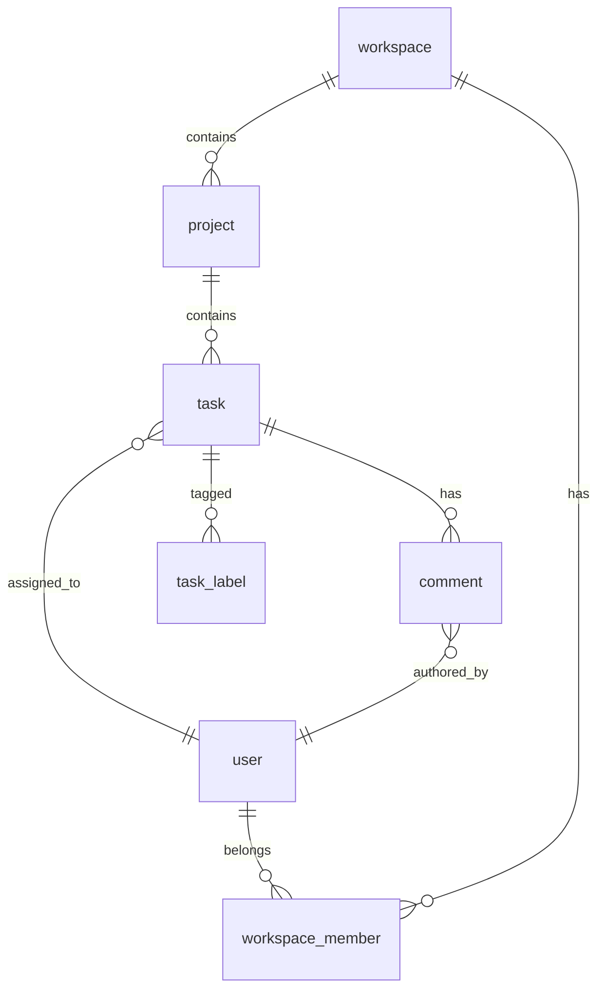
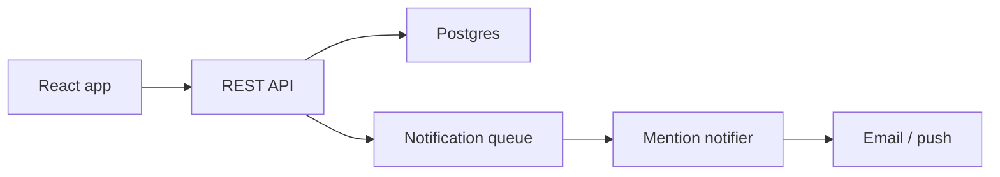

# Sample Audit — "Acme Tasks" (fictional)

> **This is a fictional walkthrough.** No real competitor was inspected, no real network traffic was captured, and all paths/payloads are illustrative. Its purpose is to show what a completed deliverable looks like end-to-end. When you run the skill for real, every claim must be traceable to actual `observed` / `documented` / `inferred` / `blocked` / `not applicable` evidence — not copied from this file.

Filled against [../references/output-template.md](../references/output-template.md). A real-world audit would attach real screenshot files; here we cite `evidence/*.png` placeholders.

---

## 1. Scope

- **Competitor**: Acme Tasks (fictional collaborative task manager)
- **Target product / repo**: `~/code/our-task-app` (hypothetical)
- **Pages and states inspected**: marketing landing, signup, dashboard, project view (kanban + list mode), task detail drawer, mobile dashboard, paid-tier upsell modal
- **Date / time inspected**: 2026-05-14 14:00–17:30 UTC+8
- **Auth state**: free-tier account (no paid features accessed)
- **Differentiation direction**: workflow parity with target design system
- **Access limits**: paid-tier "Workflow Automations" and "SSO Settings" marked blocked

## 2. Evidence

Manifest at `audit/acme-tasks/MANIFEST.md`. Today's snapshots in `audit/acme-tasks/snapshots/2026-05-14/`. Dashboard + kanban reused from the previous audit (within the 30-day window); mobile dashboard and DOM dumps re-captured because they were absent or stale. Network traces always fresh.

| Evidence | Path / URL | Source | Redaction | Notes |
| --- | --- | --- | --- | --- |
| Desktop screenshot — dashboard | `audit/acme-tasks/snapshots/2026-04-22/dashboard.png` | observed (cached from 2026-04-22) | username masked | reused via manifest |
| Desktop screenshot — project kanban | `audit/acme-tasks/snapshots/2026-04-22/kanban.png` | observed (cached from 2026-04-22) | task titles replaced with `<task N>` | reused via manifest |
| Mobile screenshot — dashboard | `audit/acme-tasks/snapshots/2026-05-14/dashboard-mobile.png` | observed | username masked | iPhone 14 viewport — fresh capture |
| DOM / text dump — task detail | `audit/acme-tasks/snapshots/2026-05-14/task-detail.html` | observed | task body + comments stripped | only structural markers kept |
| Network log — task CRUD | `audit/acme-tasks/network/2026-05-14/tasks.har` | observed | `Authorization`, `Cookie`, user IDs redacted | auth class only |
| Interactive inventory | `audit/acme-tasks/snapshots/2026-05-14/interactive-inventory.md` | observed | n/a | 87 stable IDs across 5 pages |

### Interaction Coverage

| Metric | Value |
| --- | --- |
| Interactive elements enumerated | 87 |
| Probed | 82 |
| Coverage | 82 / 87 (94%) |
| Hidden-state passes completed | hover · keyboard · right-click · drag · scroll · input-edge · network · url-history · multi-window |

5 un-probed elements: all on the paid Automations page (`acme-auto-01..05`), marked `blocked` — free-tier account cannot reach the surface.

#### Reflection round

| # | Suspected miss | Probed result |
| --- | --- | --- |
| 1 | "Saved filter" persistence after logout / re-login | `observed` — saved filters survive session via server-side `user_preferences` table |
| 2 | Bulk actions on multi-selected tasks | `observed` — `shift+click` selects range, exposes toolbar with archive / assign / label |
| 3 | Error recovery when offline submitting a comment | `observed` — queued in `localStorage`, retried on reconnect with a toast |

## 3. Executive Gap Summary

| Priority | Area | Gap | Impact | Source | Confidence | Recommendation |
| --- | --- | --- | --- | --- | --- | --- |
| P0 | Task detail | Drawer has inline comments + @mentions; target has none | Blocks team-collaboration parity | observed | high | Build comment thread + mention index; needs `comments` table + notification job |
| P0 | Kanban view | Drag-and-drop reorder persists optimistically; target lacks the view entirely | Primary workflow gap | observed | high | Add board view with DnD; API needs `position` field + reorder endpoint |
| P1 | Mobile | Sticky bottom CTA for "Add task" with safe-area inset | Mobile creation flow feels broken without it | observed | high | Add sticky CTA + `env(safe-area-inset-bottom)` padding |
| P1 | Filters | URL-encoded filter state (shareable links) | Power-user workflow | observed | medium | Move filter state to query params; add `parseFilters` reducer |
| P2 | Empty states | Animated illustrations + 3 onboarding CTAs in every empty zone | Polish, not blocking | observed | medium | Target brand illustration set; do not copy Acme's |
| P2 | Settings → Automations | Paid-only; cannot inspect | Cannot estimate scope | blocked | low | Search Acme's public docs/changelog; mark as separate epic |

## 4. UI System

### Visual Tokens

| Token | Competitor | Target Recommendation | Source |
| --- | --- | --- | --- |
| Background | near-white (#FAFAFA-ish) | keep our `--bg-canvas` | observed |
| Panel | white with 1px hairline border | keep our `--panel-1` | observed |
| Accent | warm orange | **do not copy** — use our brand teal | observed |
| Text | high-contrast near-black | our `--fg-primary` | observed |
| Radius | 8px on cards, 6px on inputs | align to our 8/6 scale (already matches) | observed |
| Spacing scale | 4 / 8 / 12 / 16 / 24 | our 4-step scale matches | observed |
| Font family | Inter-class geometric sans | our existing UI font (do not switch) | observed |

### Component Inventory

| Component | Competitor Behavior | Target Component | Status | Source | Notes |
| --- | --- | --- | --- | --- | --- |
| Top nav | Workspace switcher + global search + new-button | `<AppShell>` exists | matched | observed | |
| Sidebar | Collapsible, persists state in `localStorage` | `<SidebarNav>` exists, doesn't persist | different by design | observed | Add localStorage persistence |
| Kanban board | Multi-column DnD, virtualized | none | **missing** | observed | New component required |
| Task card | Title + assignee avatar + due chip + label dots | `<TaskRow>` (list only) | different by design | observed | Add `<TaskCard>` for board mode |
| Task detail drawer | Right-side drawer, ESC closes, URL deep-links | `<TaskDetail>` is modal | different by design | observed | Migrate to drawer or document the divergence |
| Comment thread | Inline composer + mentions + reactions | none | **missing** | observed | New subsystem |
| Filter chip bar | Chips with remove-X, URL-synced | `<FilterBar>` exists, state in component only | different by design | observed | Sync to URL |
| Upsell modal | Triggered on gated action; cannot dismiss permanently | none | blocked | observed | Out of scope until our billing ships |

### Representative Component Example

Structural pattern for the task card — using target brand tokens; do not paste Acme's class names or copy.

```html
<article class="card task-card">
  <header class="task-card__head">
    <span class="task-card__title"><!-- target copy --></span>
    
  </header>
  <footer class="task-card__meta">
    <span class="chip chip--due"></span>
    <span class="dot-row"></span>
  </footer>
</article>
```

```css
.task-card { display: flex; flex-direction: column; gap: var(--space-2); padding: var(--space-3); border-radius: var(--radius-md); }
.task-card__head { display: flex; justify-content: space-between; align-items: flex-start; gap: var(--space-2); }
.task-card__meta { display: flex; gap: var(--space-2); align-items: center; }
```

## 5. Interaction Matrix

| User Action | Competitor Result | Target Result | Status | Source | Confidence | Notes |
| --- | --- | --- | --- | --- | --- | --- |
| Click "+ New task" | Inline composer expands at top of column with focus trapped | Modal opens | different by design | observed | high | Decide: inline vs modal — recommend inline for parity |
| Drag card across columns | Optimistic move + PATCH `/tasks/:id` with `column_id`+`position` | n/a (no board) | **missing** | observed | high | Needs reorder API |
| Open task | URL becomes `/p/:proj/t/:task`, drawer slides in | URL unchanged, modal opens | different by design | observed | high | Add deep-link routing |
| Press `?` | Keyboard shortcut overlay | n/a | **missing** | observed | medium | Cheap win, P2 |
| Submit gated action (e.g. "Automate this") | Upsell modal | n/a | blocked | observed | low | Cannot inspect, paid feature |
| Mobile: scroll dashboard | Sticky bottom "+ Task" CTA above safe-area | CTA scrolls away | different by design | observed | high | Sticky + safe-area inset |
| Filter "assignee: me" | URL gains `?assignee=me`, server returns scoped list | Filter applied client-side only | different by design | observed | high | Sync to URL + server query |

### Interaction Flow — drag-and-drop reorder (proposed)

```mermaid
sequenceDiagram
  participant User
  participant UI
  participant API
  participant DB
  User->>UI: Drop card on column B at index 3
  UI->>UI: Optimistic move + new local position
  UI->>API: PATCH /tasks/:id { column_id: B, position: 3.5 }
  API->>DB: UPDATE task set column_id, position
  API-->>UI: 200 with normalized position (e.g. 4)
  UI->>UI: Reconcile position; rollback on error
```

## 6. API And Backend Mapping

| Feature | Competitor Field / Call | Target UI Field | Target API Payload | Integration Need | Status | Source | Confidence |
| --- | --- | --- | --- | --- | --- | --- | --- |
| Task reorder | `PATCH /api/tasks/:id` `{column_id, position}` | column + index on board | extend existing `PATCH /tasks/:id` | none (in-house) | needs preparation | observed | high |
| Comment thread | `POST /api/tasks/:id/comments` `{body, mentions[]}` | drawer composer | new endpoint + `comments` table | mention resolution + notifications | needs preparation | observed | medium |
| URL-synced filters | `GET /api/projects/:id/tasks?assignee=&label=` | filter bar | extend list endpoint with query params | none | can implement now | observed | high |
| Workspace switcher | `GET /api/me/workspaces` | top-nav popover | exists in target | matched | matched | observed | high |
| Workflow automations | unknown — gated | n/a | unknown | unknown | blocked | inferred | low |

### Observed Endpoints (redacted)

| Method | Route | Request Shape | Response Shape | Auth Class | Source | Notes |
| --- | --- | --- | --- | --- | --- | --- |
| GET | `/api/me/workspaces` | — | `{workspaces: [{id, name, role}]}` | session cookie | observed | role enum: `owner / admin / member / guest` |
| GET | `/api/projects/:id/tasks` | `?assignee&label&status` | `{tasks: [...], next_cursor}` | session cookie | observed | cursor-based pagination |
| PATCH | `/api/tasks/:id` | `{column_id?, position?, title?, ...}` | `{task}` | session cookie | observed | partial update |
| POST | `/api/tasks/:id/comments` | `{body, mentions: [user_id]}` | `{comment}` | session cookie | observed | rate-limit unknown |

### Blocked Or Unknown API Work

| Gap | Why Blocked | Evidence | Preparation Needed |
| --- | --- | --- | --- |
| Workflow automations | Paid-tier only, no free-trial preview | Upsell modal screenshot | Read Acme public docs / changelog; otherwise scope as separate epic |
| Webhook outbound | No incoming webhook visible in free tier | none | Check docs; mark inferred if not observable |

## 7. Data Model



### Core Tables

| Table | Purpose | Key Fields |
| --- | --- | --- |
| `task` (extend) | Add board ordering | `column_id`, `position` (float for sparse insertion) |
| `comment` (new) | Task comment thread | `id, task_id, author_id, body, mentions jsonb, created_at` |
| `task_label` (new) | M:N labels | `task_id, label_id` |

## 8. Architecture Recommendation

| Layer | Recommendation | Reason | Source | Confidence |
| --- | --- | --- | --- | --- |
| Frontend framework | Keep current (React + Vite) | No evidence Acme uses anything different that matters | observed | high |
| State management | Keep TanStack Query; add URL state for filters | URL-synced filter is the only state-management gap | observed | high |
| UI system | Keep our design system; add `<TaskCard>` and `<BoardView>` | Token scale already aligns | observed | high |
| Backend / API | Extend existing REST; no rewrite needed | All observed routes are REST-shaped | observed | high |
| Database | Existing Postgres; add `comments`, `task_label`; extend `task` | Standard relational fit | inferred | high |
| File / object storage | Not applicable in this scope | No file uploads observed in free tier | observed | high |
| Background jobs | Add notification worker for `@mentions` | Comment subsystem needs it | inferred | medium |
| External integrations | Out of scope (gated feature) | Automations are paid-tier | blocked | low |
| Auth / permissions | Existing role model covers (owner/admin/member/guest) | Matches observed roles | observed | high |
| Billing / quota | Out of scope for this audit | Target billing not yet built | not applicable | — |
| Observability | Add structured logs around reorder + comment endpoints | New high-frequency paths | inferred | medium |



## 9. Implementation Plan

| Step | Work | Readiness | Acceptance | Verification |
| --- | --- | --- | --- | --- |
| 1 | URL-synced filter state | can implement now | Filter chips reflect `?assignee&label&status`; reload preserves filters | Unit test for `parseFilters`; e2e test for reload |
| 2 | Board view + DnD with optimistic reorder | needs preparation (API extension) | Card moves between columns; refresh shows same order; rollback on 4xx | Component test for DnD; contract test for `PATCH /tasks/:id` with `position` |
| 3 | Task detail drawer + deep-link routing | can implement now | `/p/:proj/t/:task` opens drawer; ESC closes; back-button returns to list | e2e for routing; a11y check for focus trap |
| 4 | Comment thread (composer + render) | needs preparation (new endpoint + table) | Comment appears optimistically; mentions resolve to user chips | API route tests; render test for mentions |
| 5 | Mention notifications worker | needs preparation (queue) | `@user` mention creates a notification record + email within 30s | Worker integration test against test queue |
| 6 | Mobile sticky `+ Task` CTA with safe-area | can implement now | CTA visible above iOS home indicator; no overlap with bottom nav | Visual diff on iPhone 14 viewport |
| 7 | `?` keyboard shortcut overlay | can implement now | Pressing `?` toggles overlay; ESC closes | Unit test for keymap; visual snapshot |

## 10. Verification Checklist

- [x] Screenshot evidence captured for competitor and target.
- [x] Evidence is redacted; no secrets, private data, or one-time URLs.
- [x] Component inventory complete.
- [x] Interaction matrix covers small controls and post-submit actions.
- [x] API mapping separates observed / documented / inferred / blocked / missing.
- [x] Data and architecture diagrams included; out-of-scope rows marked.
- [x] Blocked backend work (Automations) separated from ready work.
- [ ] Tests cover new UI behavior and payload mapping. *(will be filled during step-by-step implementation)*
- [ ] Build / typecheck / lint passed. *(per-step)*
- [ ] Desktop and mobile visual checks passed. *(per-step)*
- [x] Missing backend work (comments, reorder, mentions) documented, not silently dropped.
