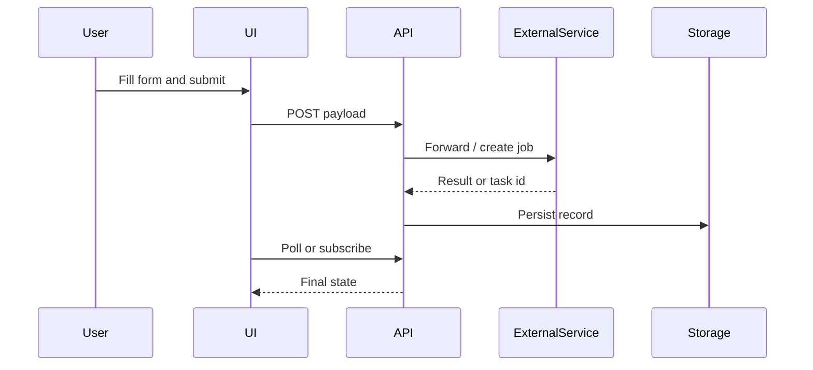
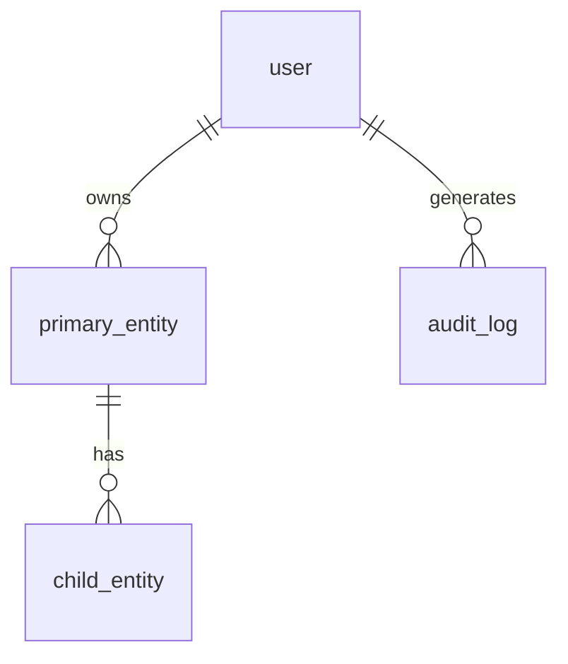
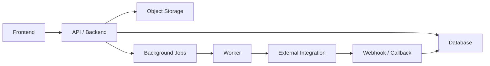

# Website Replication Deliverable Template

Use this structure for an implementation-ready replication report. Keep claims tied to evidence. "Competitor" below means *the reference site being audited* — it may also be a legacy product, partner integration, or inspiration source.

Adapt section depth to the competitor's domain (SaaS / e-commerce / content / collaboration / AI tool / marketplace / internal tool). Remove sections that do not apply and say so explicitly rather than leaving empty tables.

## 1. Scope

- Competitor:
- Target product / repo:
- Pages and states inspected:
- Date / time inspected:
- Auth state:
- Differentiation direction:
- Access limits:

## 2. Evidence

Only include redacted evidence. Do not expose cookies, authorization headers, session IDs, tokens, customer data, uploaded contents, private messages, account identifiers, or one-time URLs.

| Evidence | Path / URL | Source | Redaction | Notes |
| --- | --- | --- | --- | --- |
| Desktop screenshot |  | observed |  |  |
| Mobile screenshot |  | observed |  |  |
| Focused component screenshot |  | observed |  |  |
| DOM / text dump |  | observed |  |  |
| Network log / API trace |  | observed |  |  |
| Interactive inventory | `evidence/interactive-inventory.md` | observed |  | DOM-enumerated, stable IDs |

### Interaction Coverage

| Metric | Value |
| --- | --- |
| Interactive elements enumerated | N |
| Probed | M |
| Coverage | M / N (X%) |
| Hidden-state passes completed | hover · keyboard · right-click · drag · scroll · input-edge · network · url-history · multi-window |

Coverage below 90% without a `blocked` reason is **not acceptable** — list un-probed elements and the reason here before finalizing.

#### Reflection round

Three things most likely to have been missed (per Workflow step 7), and the result of probing each:

| # | Suspected miss | Probed result |
| --- | --- | --- |
| 1 |  | observed / inferred / blocked / confirmed-absent |
| 2 |  | observed / inferred / blocked / confirmed-absent |
| 3 |  | observed / inferred / blocked / confirmed-absent |

## 3. Executive Gap Summary

| Priority | Area | Gap | Impact | Source | Confidence | Recommendation |
| --- | --- | --- | --- | --- | --- | --- |
| P0 |  |  |  | observed / documented / inferred | high / medium / low |  |
| P1 |  |  |  | observed / documented / inferred | high / medium / low |  |
| P2 |  |  |  | observed / documented / inferred | high / medium / low |  |

## 4. UI System

### Visual Tokens

| Token | Competitor | Target Recommendation | Source |
| --- | --- | --- | --- |
| Background |  |  | observed |
| Panel |  |  | observed |
| Accent |  |  | observed |
| Text |  |  | observed |
| Radius |  |  | observed |
| Spacing scale |  |  | observed |
| Font family |  |  | observed |

### Component Inventory

| Component | Competitor Behavior | Target Component | Status | Source | Notes |
| --- | --- | --- | --- | --- | --- |
|  |  |  | matched / different by design / missing / blocked / not applicable |  |  |

### Representative Component Example

Demonstrate only the *structural pattern* using the target brand's own tokens and copy. Do not paste competitor class names, exact spacing values, copy, or distinctive composition. Skip this block if no reusable pattern is worth documenting.

```html
<!-- target-brand markup illustrating the pattern, not a copy of competitor markup -->
```

```css
/* tokens / layout primitives only */
```

```js
// event/state pattern only when non-obvious
```

## 5. Interaction Matrix

Rows below are *examples* of common interactions to consider. Replace with the actual user actions in scope; do not leave generic placeholders in the final deliverable.

| User Action | Competitor Result | Target Result | Status | Source | Confidence | Notes |
| --- | --- | --- | --- | --- | --- | --- |
| Primary CTA |  |  |  | observed / documented / inferred |  |  |
| Mode / tab switch |  |  |  | observed / documented / inferred |  |  |
| Secondary action (clear / copy / save / expand) |  |  |  | observed / documented / inferred |  |  |
| Upload / select source |  |  |  | observed / documented / inferred |  |  |
| Submit / confirm |  |  |  | observed / documented / inferred |  |  |
| Post-submit / result action |  |  |  | observed / documented / inferred |  |  |
| Gated state (auth / quota / paywall) |  |  |  | observed / documented / inferred |  |  |

### Interaction Flow

Include a sequence diagram only when async work, third-party services, or background storage matters. Otherwise skip.



## 6. API And Backend Mapping

| Feature | Competitor Field / Call | Target UI Field | Target API Payload | Integration Need | Status | Source | Confidence |
| --- | --- | --- | --- | --- | --- | --- | --- |
|  |  |  |  |  |  | observed / documented / inferred | high / medium / low |

### Observed / Documented Endpoints

| Method | Route | Request Shape | Response Shape | Auth Class | Source | Notes |
| --- | --- | --- | --- | --- | --- | --- |
| POST |  | redacted | redacted |  | observed / documented |  |
| GET |  | redacted | redacted |  | observed / documented |  |

### Blocked Or Unknown API Work

| Gap | Why Blocked | Evidence | Preparation Needed |
| --- | --- | --- | --- |
|  | missing docs / auth / paid access / private target API |  |  |

## 7. Data Model

Replace the example entities below with the actual domain. Common shapes by product type:

- **SaaS / collaboration**: users, organizations, workspaces, members, primary domain object, activity log.
- **E-commerce**: users, products, variants, carts, orders, payments, shipments.
- **Content / publishing**: users, posts, media, collections, comments, subscriptions.
- **AI / generative tool**: users, projects, jobs, assets, prompts, credits.
- **Marketplace**: buyers, sellers, listings, transactions, reviews.
- **Internal tool**: users, roles, records, events, audit log.



### Core Tables

| Table | Purpose | Key Fields |
| --- | --- | --- |
|  |  |  |

## 8. Architecture Recommendation

Only fill rows that the audit's evidence supports. Mark out-of-scope rows `not applicable`.

| Layer | Recommendation | Reason | Source | Confidence |
| --- | --- | --- | --- | --- |
| Frontend framework |  |  | observed / documented / inferred |  |
| State management |  |  | observed / documented / inferred |  |
| UI system |  |  | observed / documented / inferred |  |
| Backend / API |  |  | observed / documented / inferred |  |
| Database |  |  | observed / documented / inferred |  |
| File / object storage |  |  | observed / documented / inferred |  |
| Background jobs / queue |  |  | observed / documented / inferred |  |
| External integrations |  |  | observed / documented / inferred |  |
| Auth / permissions |  |  | observed / documented / inferred |  |
| Billing / quota |  |  | observed / documented / inferred |  |
| Observability |  |  | observed / documented / inferred |  |



## 9. Implementation Plan

| Step | Work | Readiness | Acceptance | Verification |
| --- | --- | --- | --- | --- |
| 1 |  | can implement now / needs preparation |  |  |
| 2 |  | can implement now / needs preparation |  |  |
| 3 |  | can implement now / needs preparation |  |  |

## 10. Verification Checklist

- [ ] Screenshot evidence captured for competitor and target.
- [ ] Evidence is redacted; no secrets, private data, or one-time URLs.
- [ ] Interactive inventory generated via DOM enumeration; coverage M / N ≥ 90% or gaps justified.
- [ ] All hidden-state passes completed or marked `not applicable` with reason.
- [ ] Reflection round (3 likely-missed candidates) probed and recorded.
- [ ] Component inventory complete.
- [ ] Interaction matrix covers small controls and post-submit actions.
- [ ] API mapping separates observed / documented / inferred / blocked / missing.
- [ ] Data and architecture diagrams included when backend work matters; otherwise marked not applicable.
- [ ] Blocked backend / API work is separated from ready implementation work.
- [ ] Tests cover new UI behavior and payload mapping (when working in a repo).
- [ ] Build / typecheck / lint passed.
- [ ] Desktop and mobile visual checks passed.
- [ ] Missing backend work is documented, not silently removed from scope.
