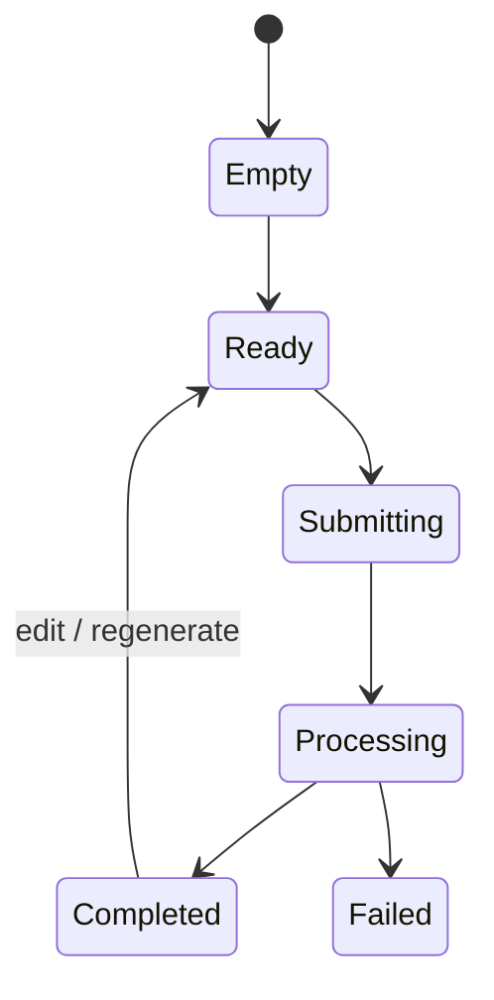

# Replication PRD Template

Use this after the audit evidence and page region model are complete. A PRD is required for implementation-ready replication work; a gap report alone is not enough.

## 1. Product Objective

- Reference site / workflow:
- Target product / repo:
- User problem:
- Success outcome:
- Differentiation direction:
- Non-goals:

## 2. User Workflow

Describe the end-to-end path in implementation terms.

| Step | User Action | System Response | Region(s) Involved | Source |
| --- | --- | --- | --- | --- |
| 1 |  |  | Z1, Z2 | observed / inferred |

## 3. Page Region Model

Link or inline the final model from `region-model-template.md`.

- Region model artifact:
- Region relationship graph:
- Page-level state machine:

## 4. Region Requirements

Repeat this contract for every major region.

### Z1: <Region Name>

Purpose:

-

Visible When:

- Desktop:
- Mobile:
- Gated / auth:

Owns State:

-

Consumes:

-

Emits:

-

Updates:

-

UI Requirements:

-

Behavior Requirements:

-

Empty / Loading / Error / Success:

- Empty:
- Loading:
- Error:
- Success:

Acceptance Criteria:

- [ ]

## 5. Cross-Region Interaction Contracts

| Contract ID | Trigger Region | Trigger | Target Region | Required State Change | API / Data Dependency | Acceptance |
| --- | --- | --- | --- | --- | --- | --- |
| C1 | Z1 | submit valid form | Z2 | empty -> loading; then result/error | create task + poll status |  |

## 6. Data And API Contracts

| Feature | UI Field / Event | Target Payload | Validation | Response Handling | Persistence | Source |
| --- | --- | --- | --- | --- | --- | --- |
|  |  |  |  |  |  | observed / documented / inferred |

## 7. State Machines

### Page State

### Async Job State

| State | Entered When | UI Region Impact | Exit Condition | Error Handling |
| --- | --- | --- | --- | --- |
| queued |  |  |  |  |
| processing |  |  |  |  |
| completed |  |  |  |  |
| failed |  |  |  |  |

## 8. Responsive And Accessibility Requirements

- Desktop layout:
- Tablet layout:
- Mobile layout:
- Keyboard / focus:
- Screen reader labels:
- Minimum tap targets:
- Overflow rules:

## 9. Implementation Plan

| Phase | Work | Readiness | Dependencies | Acceptance | Verification |
| --- | --- | --- | --- | --- | --- |
| 1 |  | can implement now / needs preparation |  |  |  |

## 10. Verification Plan

- Unit/component tests:
- Payload contract tests:
- API route tests:
- Browser flow tests:
- Desktop/mobile screenshot checks:
- Region relationship checks:
- Evidence redaction check:

## 11. Open Questions And Blockers

| Item | Type | Blocking? | Owner / Next Step |
| --- | --- | --- | --- |
|  | unknown / blocked / decision | yes / no |  |

## 12. PRD Completeness Checklist

- [ ] Every `Z*` region has a requirement contract.
- [ ] Every cross-region dependency has a contract ID.
- [ ] Input regions specify emitted events and payload shape.
- [ ] Output regions specify consumed state and update triggers.
- [ ] Empty/loading/error/success states are specified where relevant.
- [ ] Mobile behavior is specified for every major region.
- [ ] API/data contracts are tied to region interactions.
- [ ] Acceptance criteria are testable.
- [ ] Blocked work is separated from ready implementation work.
