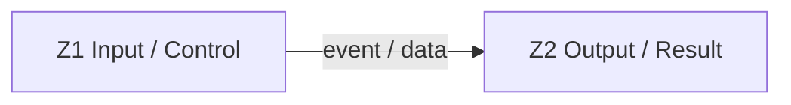

# Quick Competitor Audit Template

Use for a one-page or one-workflow audit that fits in ≤ 1 hour. Time budget guidance: 10 min scope + evidence · 15 min UI / interactions · 15 min API capture · 10 min gap list · 10 min write-up.

Skip any section that does not apply and say so explicitly (e.g. `no backend in scope`) instead of leaving placeholders.

## 1. Scope

- Competitor URL:
- Page / workflow in scope:
- Auth state during inspection:
- Date inspected:
- Differentiation direction: workflow parity with original style / same features with target design system / research only
- Known access limits (paywall / login / region):

## 2. Evidence

| Evidence | Path / URL | Source | Notes |
| --- | --- | --- | --- |
| Desktop screenshot |  | observed |  |
| Mobile screenshot |  | observed |  |
| DOM / text dump |  | observed |  |
| Network log |  | observed | redacted |
| Interactive inventory |  | observed | DOM-enumerated, stable IDs |

All evidence must be redacted: no cookies, auth headers, tokens, account IDs, customer data, private message contents, or one-time URLs.

### Interaction Coverage

- Interactive elements enumerated: __
- Probed: __ / __ (target ≥ 90%, else list un-probed below with reason)
- Hidden-state passes done: hover · keyboard · right-click · drag · scroll · input-edge · network · url-history · multi-window
- Reflection (3 likely-missed candidates + probe result):
  1. __ → __
  2. __ → __
  3. __ → __

## 3. UI Snapshot

### Tokens

| Token | Competitor | Target Recommendation |
| --- | --- | --- |
| Background |  |  |
| Accent |  |  |
| Text |  |  |
| Radius |  |  |
| Spacing scale |  |  |
| Font family |  |  |

### Component Inventory (top 5–10 only)

| Component | Competitor Behavior | Target Status | Notes |
| --- | --- | --- | --- |
|  |  | matched / different / missing / blocked |  |

## 4. Region Relationship Snapshot

Keep this short, but do not skip it. The goal is to capture how areas of the page work together.

| Zone ID | Region | Purpose | Owns State | Consumes State | Emits Events | Updates |
| --- | --- | --- | --- | --- | --- | --- |
| Z1 |  |  |  |  |  |  |
| Z2 |  |  |  |  |  |  |

### Layout Constraints

| Region | Placement | Anchor | Scroll Behavior | Mobile Transform | Evidence |
| --- | --- | --- | --- | --- | --- |
| Z1 | bottom / left / overlay | viewport / parent / sibling | fixed / sticky / scrolls away / independently scrollable | side panel -> bottom sheet | screenshot + bbox |

## 5. Interaction Matrix

List actual user actions in scope. Replace example rows; do not ship the template stubs.

| User Action | Source Region | Target Region | Competitor Result | Target Status | Source | Notes |
| --- | --- | --- | --- | --- | --- | --- |
| Primary CTA | Z1 | Z2 |  |  | observed / inferred |  |
| Mode / tab switch |  |  |  |  | observed / inferred |  |
| Secondary action |  |  |  |  | observed / inferred |  |
| Submit / confirm |  |  |  |  | observed / inferred |  |
| Post-submit / result |  |  |  |  | observed / inferred |  |
| Gated state |  |  |  |  | observed / inferred |  |

## 6. API / Backend Notes

Skip the table and write `no backend work in scope` if research-only.

| Feature | Region / Contract | Observed Call (redacted) | Auth Class | Target Mapping | Status |
| --- | --- | --- | --- | --- | --- |
|  | Z1 / C1 | METHOD route, payload shape |  |  | implemented / partial / missing / blocked |

## 7. PRD Slice

For quick audits, write only the requirements needed for the primary workflow.

| Requirement | Region(s) | Acceptance | Readiness |
| --- | --- | --- | --- |
|  | Z1, Z2 |  | can implement now / needs preparation |

## 8. Gap List

| Priority | Gap | Region / Contract | Readiness | Recommendation |
| --- | --- | --- | --- | --- |
| P0 |  |  | can implement now / needs preparation |  |
| P1 |  |  | can implement now / needs preparation |  |
| P2 |  |  | can implement now / needs preparation |  |

## 9. Verification Checklist

- [ ] Screenshots saved (desktop + mobile).
- [ ] Evidence is redacted.
- [ ] Interactive inventory generated; coverage ≥ 90% or gaps justified.
- [ ] Hidden-state passes done or marked `not applicable`.
- [ ] Reflection round (3 candidates) probed.
- [ ] Region relationship snapshot includes `Z*` IDs, owned state, consumed state, emitted events, and updates.
- [ ] Layout Constraints captured for major regions, including fixed / sticky / docked behavior and mobile transform.
- [ ] Interaction matrix covers small / icon-only controls.
- [ ] API status separates observed / documented / inferred / blocked / missing.
- [ ] PRD slice contains testable acceptance criteria.
- [ ] Gap list splits "can implement now" vs "needs preparation".
- [ ] No competitor logo, copy, or distinctive composition copied into target.
