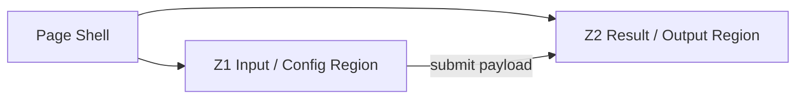
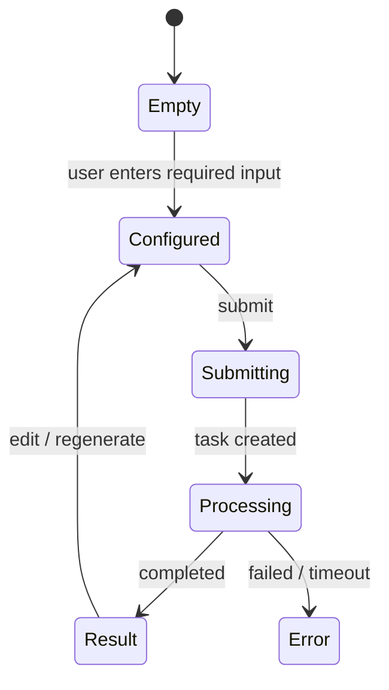

# Page Region Relationship Model Template

Use this before writing an implementation-ready replication PRD. The goal is to understand how page regions cooperate, not just what controls exist.

## 1. Region Map

Assign stable IDs (`Z1`, `Z2`, `Z3`...) to semantic regions. A region is a responsibility boundary: generator panel, result panel, history list, settings drawer, checkout summary, asset preview, editor canvas, etc.

| Zone ID | Region Name | Evidence / Selector | Visual Position | Purpose | Owns State | Consumes State | Emits Events | Updates | Source | Confidence |
| --- | --- | --- | --- | --- | --- | --- | --- | --- | --- | --- |
| Z1 |  | screenshot / DOM selector / inventory IDs | left / right / top / modal / drawer |  |  |  |  |  | observed / inferred | high / medium / low |

## 2. Region Layout And Containment

Use this to capture hierarchy and adjacency.

| Parent Region | Child / Adjacent Region | Relationship | Responsive Rule | Evidence |
| --- | --- | --- | --- | --- |
| Page shell | Z1 | contains | desktop two-column; mobile stacked |  |
| Z1 | Z2 | adjacent; Z1 drives Z2 | Z2 moves below Z1 on mobile |  |

## 3. Region Layout Constraints

Use this to capture how each region is placed and constrained, not just what it does. Prefer product-level layout terms over pixel copying.

| Region | Placement | Anchor Target | Positioning Mode | Sizing Rule | Scroll Behavior | Layering / Containment | Responsive Transform | Collision Rules | Evidence | Source | Confidence |
| --- | --- | --- | --- | --- | --- | --- | --- | --- | --- | --- | --- |
| Z1 | bottom / left / overlay / drawer | viewport / parent / sibling / scroll container / safe area | normal-flow / fixed / sticky / absolute / docked / floating | fixed / fill / intrinsic / min-max / aspect-ratio / content-driven | scrolls with page / fixed during scroll / sticky within container / independently scrollable | inline / overlay / z-layer / backdrop / clipped / reserves space | desktop side panel -> mobile bottom sheet | avoids keyboard / safe-area / bottom nav / FAB / toast | screenshot + bbox + computed style | observed / inferred | high / medium / low |

## 4. Region Dependency Matrix

Every important region should have at least one clear responsibility and, when applicable, a dependency or event relationship.

| From Region | Event / Data | To Region | Trigger | Target State Change | API / Storage Dependency | Evidence |
| --- | --- | --- | --- | --- | --- | --- |
| Z1 | form payload | Z2 | submit | empty -> loading -> result/error | POST task + polling |  |
| Z2 | edit selected result | Z1 | click edit/regenerate | populate previous settings | saved job payload |  |

## 5. Region State Contracts

| Region | Empty | Ready | Loading | Success | Error | Disabled / Gated |
| --- | --- | --- | --- | --- | --- | --- |
| Z1 |  |  |  |  |  |  |
| Z2 |  |  |  |  |  |  |

## 6. Page-Level State Machine

Only include states supported by evidence. Mark unsupported or inaccessible states `inferred` or `blocked`.

## 7. Region Modeling Checklist

- [ ] Every major visual area has a `Z*` region ID.
- [ ] Each region has a business purpose, not just a visual label.
- [ ] Every major region has Region Layout Constraints: placement, anchor target, positioning mode, sizing, scroll behavior, layering / containment, responsive transform, and collision rules.
- [ ] Input regions list owned state and emitted events.
- [ ] Output regions list consumed state and update triggers.
- [ ] Shared/gating state is modeled separately: auth, credits, selection, history, current job, cart, permissions.
- [ ] At least one relationship graph or matrix explains how regions update each other.
- [ ] Mobile/tablet changes preserve the same region responsibilities or document what changes.
- [ ] Sticky / fixed / docked regions, independent scroll containers, overlays, safe-area insets, and keyboard avoidance are captured when present.
- [ ] Unknown relationships are marked `inferred` or `blocked`, not silently omitted.
